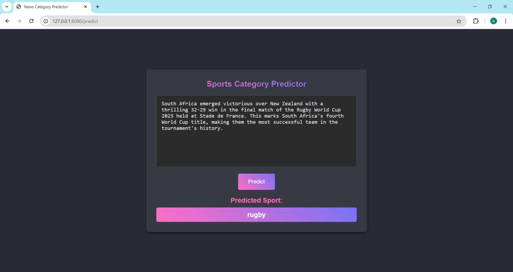

# Sports News Classification with Machine Learning and Web Application

## Overview

This project combines machine learning and web development to classify sports news articles into five categories: **football**, **rugby**, **cricket**, **athletics**, and **tennis**. It utilizes a **Naive Bayes model** trained on the **BBCSport dataset** and a **TF-IDF vectorizer** to preprocess and convert text data into a format suitable for classification. The web application, built using **Flask**, allows users to input text and receive real-time predictions of the sports category.

This model has practical applications in automating the categorization of sports news articles, enhancing content management systems, and improving user experiences on sports news platforms. By providing accurate classifications, it can help users quickly find articles of interest, assist journalists in organizing content, and support researchers analyzing trends in sports reporting.


### Key Features
- **Text Preprocessing**: 
  - Converting text to lowercase
  - Removing stopwords, single characters, and numbers
  - Applying stemming to reduce words to their root form
  - Vectorizing text using **TF-IDF**
- **Machine Learning Model**: 
  - Trained a **Naive Bayes classifier** to predict the category of sports articles with an accuracy of **1.0**.
- **Web Application**:
  - Real-time prediction using the pre-trained model.
  - User-friendly and responsive web interface.
  - Supports live prediction of text category based on input.

## Dataset

The dataset used is the [BBCSport dataset](http://mlg.ucd.ie/datasets/bbc.html), which contains sports news articles across five categories: **football**, **rugby**, **cricket**, **athletics**, and **tennis**.

## Project Structure

```plaintext
sports-news-classification/
│
├── app.py
├── sport_model.pkl
├── sport_vectorizer.pkl
├── templates/
│   └── index.html
├── static/
│   └── styles.css
├── bbcsport/
│   ├── football/ 
│   │   └── *.txt 
│   ├── rugby/    
│   │   └── *.txt 
│   ├── cricket/  
│   │   └── *.txt 
│   ├── athletics/
│   │   └── *.txt
│   └── tennis/  
│   │   └── *.txt
│   └── README.TXT
├── sports_news.ipynb
├── README.md
└── requirements.txt
```

## Installation

To run this project locally, follow these steps:

```bash
# Clone the repository
git clone https://github.com/AhmedNabil03/sports-news-classification.git

# Navigate to the project directory
cd sports-news-classification

# Create and activate a virtual environment (optional but recommended)
python -m venv venv
source venv/bin/activate  # On Windows use: venv\Scripts\activate

# Install the required dependencies
pip install -r requirements.txt
```

## Usage
To classify sports news via the web application:

1. Run the Flask application: ```python app.py```
2. Open your browser and go to [http://127.0.0.1:8080/](http://127.0.0.1:8080/).
3. Enter the sports news text in the text box.
4. Click the "Predict" button to see the predicted category.

You can also try the live demo of the Sports News Category Predictor by visiting the following link: [**Sports News Category Predictor Demo**](https://ahmednabil.pythonanywhere.com/).



## Results

The **Naive Bayes** classifier achieved outstanding results on the **BBCSport** dataset:
- **Accuracy**: 1.0
- **F1 Score**: 1.0

These metrics demonstrate the effectiveness of the model in accurately classifying sports news articles across the five categories.

## Demo

You can try out the live demo of the Sports News Category Predictor by visiting the following link:

[**Sports News Category Predictor Demo**](https://ahmednabil.pythonanywhere.com/)

> **Note**: This is a temporary demo and may be taken down in the future.


